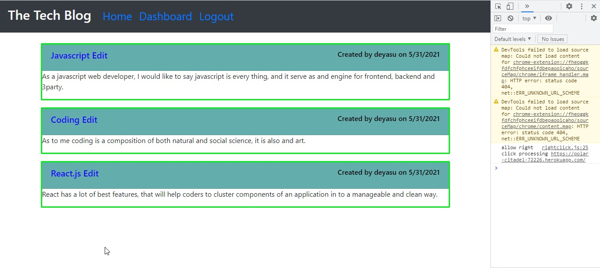
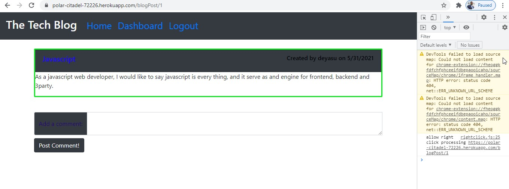

## License badge: ](https://opensource.org/licenses/ISC)

# Tech-Blog

## Table of Content
- [Description](#description)
- [Instructions](#instructions)
- [Usage](#usage)
- [Test instruction](#test-instruction)
- [Lesson learned](#lesson)
- [Acknowledgement](#acknowledgement)
- [Question](#question)

## Description 

This app is built post, edit, delete and comment a blogpost. To perform those activities a user should have to signup and login by using a credential information.  
I used diffrent technologies including express, mysql2, seed, Javascript, HTML, CSS, a software registry and software package manager and installer called Node Package Manager (npm)node.js and other relevant node.js frameworks. 

## Instructions

First signup, and then login by using the information you used during a sign up process. Next you can post, edit delete your own posts. In addition you can comment on others post. 

## Usage 

You do not have a limitation to use this application. As you see the license section at the top of this file it is open source to use, copy, modify, and/or distribute this app for any purpose. 

## Test instruction 

I checked the application for many times, and it works well. If you want you can click on a likn below.

## Lesson-learned

I got some take away like how and when to use different packages.

## Acknowledgement

My instructor, my tutor, online information providers like google, you tube and others.

## Question

If you have any questions you can reach me via [email](mailto:bayleyegn100@gmail.com).

Here is a link of my Github page: [Github](https://github.com/bayleyegn100)

